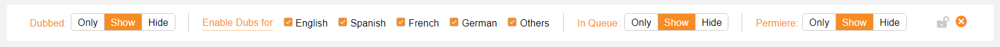

# Release/Simulcast Calendar Filter for Crunchyroll

  

 

Release/Simulcast Calendar Helper for Crunchyroll is filter for the Release/Simulcast Calendar on Crunchyroll. It aims to make finding something to watch using the Release Calendar easier and adds UI elements to accomplish that. 

 

 

  

## Added UI elements

### The Filter element

  

Using the filter element, you can:

- Toggle visibility for all dubbed episodes on the calendar.
- Toggle visibility for dubbed episodes in a specific language.
- Toggle visibility for all subbed episodes on the calendar.
- Include, show only, or hide episodes that are 'In Queue' (if logged in)
- Include, show only, or hide episodes that are premiering.
- You can combine any of the above to see what you want to see.

You can also lock filters! So, your choices are applied automatically when you go back to the release calendar or browse another week.

Don't see the language you want on the filter UI? You can change that in the options page!

In the options page you can also hide this element so that it doesn't display on the screen, if the filter is locked it will still be applied.

### The Hidden Count elements

  

This element displays the episodes that are hidden for all the days. When the count changes there is a short animation to indicate that there was a change.

Both the animation and the element itself can be hidden in the extension’s option page.

### The Smaller Progress elements

  

By default, Crunchyroll only shows watch progress on episodes on the selected day. This extension add a watch progress bar to all episodes on all days. To not clutter the UI too much this is only shown on episodes when the watch progress is > 0.

---

## Building The Extension Locally

1. Inside the `/ext` directory, run `npm install` in the folder to install dependencies
2. Run `npm run build` to generate the distribution directories

## Running The Extension Locally (in Firefox)

3. Navigate to `about:debugging#/runtime/this-firefox` in your browser
4. Click `Load Temporary Add-on...`
5. Select the `/dist_firefox` folder in this directory

## Running The Extension Locally (in Google Chrome)

3. Navigate to `chrome://extensions` in your browser
4. Ensure `Developer mode` is `enabled` (top right)
5. Click `Load unpacked` in the top left
6. Select the `/dist` folder in this directory

After completing the above steps, you should see the developer, unpacked version appears in your extension list. To trigger the extension, simply go to `https://www.crunchyroll.com/simulcastcalendar`.

---

## Building The Extension For Stores

1. Inside the `/ext` directory, run `npm install` in the folder to install dependencies
2. Run `npm run build:prod` to generate the distribution directories
3. The `/dist_firefox` folder contains the Firefox version
4. The `/dist` folder contains the Chrome Version

## External Libraries

This extension uses the following external libraries:

- [CalDOM](https://github.com/dumijay/CalDOM/)
- [Popper v2](https://github.com/floating-ui/floating-ui)
- [WebExtension `browser` API Polyfill](https://github.com/mozilla/webextension-polyfill/)
